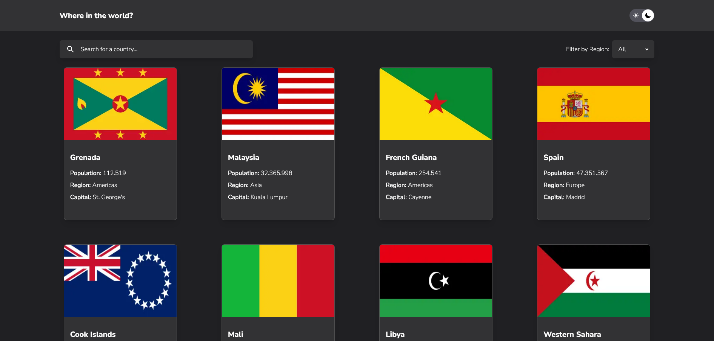

# Frontend Mentor - REST Countries API with color theme switcher solution

This is a solution to the [REST Countries API with color theme switcher challenge on Frontend Mentor](https://www.frontendmentor.io/challenges/rest-countries-api-with-color-theme-switcher-5cacc469fec04111f7b848ca). Frontend Mentor challenges help you improve your coding skills by building realistic projects.

## Table of contents

- [Overview](#overview)
  - [The challenge](#the-challenge)
  - [Screenshot](#screenshot)
  - [Links](#links)
  - [Built with](#built-with)
  - [Author](#author)

## Overview

### The challenge

Users should be able to:

- See all countries from the API on the homepage
- Search for a country using an `input` field
- Filter countries by region
- Click on a country to see more detailed information on a separate page
- Click through to the border countries on the detail page
- Toggle the color scheme between light and dark mode _(optional)_

### Screenshot

### Links

- Solution URL: [here](https://github.com/Marcosfitzsimons/rest-countries-app)
- Live Site URL: [here](rest-countries-app-five.vercel.app)

### Built with

- Semantic HTML5 markup
- Flexbox
- CSS Grid
- Mobile-first workflow
- [React](https://reactjs.org/) - JS library
- [Next.js 13](https://nextjs.org/) - React framework
- [TailwindCSS](https://tailwindcss.com/) - For styles

## Author

- Website - [Marcos Valentín Fitzsimons](https://marcosfitzsimons-portfolio.vercel.app/)
- Frontend Mentor - [@marcosfitzsimons](https://www.frontendmentor.io/profile/Marcosfitzsimons)
